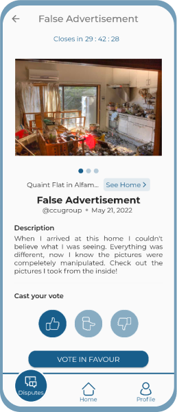

# R-HOME - G02


_A higher quality of living_

## App Preview




## Demo

[](https://drive.google.com/file/d/17cdk404G11T7XEnBST-gLjoYpuNHBik9/view?usp=sharing)

## DDD Architecture


## Usage

* [Install Flutter](https://flutter.dev/docs/get-started/install)
* Since this is a Firebase dependent project, either create a Firebase Project and follow [Setup New Firebase](#setup-new-firebase) or use our Firebase backend and follow [Setup Existing Firebase](#setup-existing-firebase)
  * Firebase Phone Authentication (for authentication)
  * Cloud Firestore (not Realtime Database)
  * Firebase Storage (for storing images)
  * Firebase In-App Messaging (for custom messages)
* After enabling the above features, download the `google-services.json` and move it to the `android/app` folder.
* Execute `flutter pub get` to get the package dependencies.
* Use a physical device or an emulator and run `flutter run`.

## Setup New Firebase

1. You'll need to create a Firebase instance. Follow the instructions at https://console.firebase.google.com.
2. Once your Firebase instance is created, you'll need to enable Google authentication.

* Go to the Firebase Console for your new instance.
* Click "Authentication" in the left-hand menu
* Click the "sign-in method" tab
* Click "Google" and enable it

3. Enable the Firebase Database
* Go to the Firebase Console
* Click "Database" in the left-hand menu
* Click the Cloudstore "Create Database" button
* Select "Start in test mode" and "Enable"

4. Debug keystore fingerprint

* Create an app within your Firebase instance for Android, with package name com.yourcompany.news
* Run the following command to get your SHA-1 key:

```
keytool -exportcert -list -v -alias androiddebugkey -keystore ~/.android/debug.keystore
```

* In the Firebase console, in the settings of your Android app, add your SHA-1 key by clicking "Add Fingerprint".
* Follow instructions to download google-services.json
* Move `google-services.json` into `/android/app/`.

Double check install instructions for both:
   - Google Auth Plugin
     - https://pub.dartlang.org/packages/firebase_auth
   - Firestore Plugin
     -  https://pub.dartlang.org/packages/cloud_firestore


## Setup Existing Firebase

1. Generate SHA-1 Debug keystore fingerprint

* Run the following command to get your SHA-1 key:

```
keytool -exportcert -list -v -alias androiddebugkey -keystore ~/.android/debug.keystore
```

2. Send the previously generated SHA-1 fingerprint to us, by contacting <lucasvicente@tecnico.ulisboa.pt>. We will add your fingerprint to our existing Firebase backend. 

3. We will send back the `google-services.json` file which should be placed in the `android/app` folder.